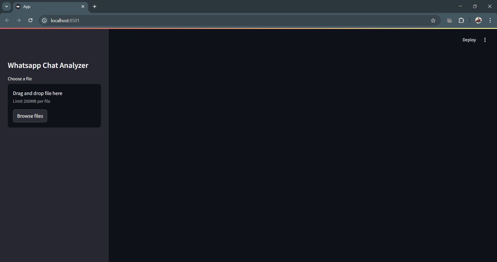
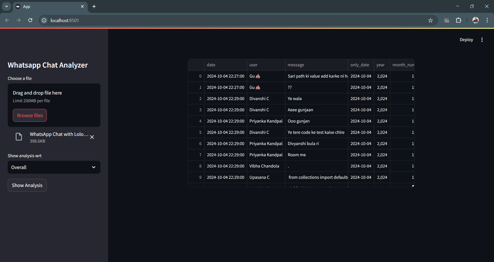

# WhatsApp Chat Analyzer

A comprehensive Streamlit web application that analyzes WhatsApp chat exports to provide detailed insights and visualizations about conversation patterns, user engagement, and content analysis.

## Project Overview

This application allows users to upload their WhatsApp chat export files and gain valuable insights through interactive visualizations and statistics. Whether you want to analyze group dynamics or individual messaging patterns, this tool provides a user-friendly interface to explore your chat data.

## Key Features

- **Chat Import & Processing**: Upload and parse WhatsApp chat exports in standard format
- **User-specific Analysis**: Filter analysis by individual users or view overall group statistics
- **Comprehensive Message Analytics**:
  - Message volume statistics (total messages, words, media shared)
  - URL/link sharing patterns
  - Monthly and daily message timelines
  - Hourly activity heatmaps
  - Day-of-week activity patterns
- **Content Analysis**:
  - Interactive word clouds of most frequently used terms
  - Common words analysis with frequency charts
  - Detailed emoji usage statistics and rankings
- **Interactive Visualizations**: Dynamic charts and graphs for all analytics

## Installation

### Prerequisites
- Python 3.7 or higher
- pip package manager

### Setup Instructions

1. Clone the repository:
   ```
   git clone https://github.com/yourusername/whatsapp-chat-analyzer.git
   cd whatsapp-chat-analyzer
   ```

2. Install the required dependencies:
   ```
   pip install -r requirements.txt
   ```
   
   Alternatively, install packages individually:
   ```
   pip install streamlit pandas matplotlib seaborn wordcloud urlextract emoji
   ```

3. Run the application:
   ```
   streamlit run App.py
   ```

4. The application will open in your default web browser at `http://localhost:8501`

## How to Use

1. **Export your WhatsApp chat**:
   - Open WhatsApp on your phone
   - Go to the chat you want to analyze
   - Tap the three dots (menu) > More > Export chat
   - Choose "Without Media"
   - Save or email the exported .txt file

2. **Analyze your chat**:
   - Launch the application
   - Upload the exported .txt file using the file uploader
   - Select a specific user from the dropdown or choose "Overall" for group analysis
   - Click "Show Analysis" to generate visualizations
   - Scroll through the various charts and statistics

## Screenshots





## Technologies Used

- **Python**: Core programming language
- **Streamlit**: Web application framework for data apps
- **Pandas**: Data manipulation and analysis
- **Matplotlib & Seaborn**: Data visualization
- **WordCloud**: Text visualization for frequent words
- **URLExtract**: URL extraction from text
- **Emoji**: Emoji processing and analysis

### Project Structure

- `App.py`: Main application file with Streamlit UI
- `preprocessor.py`: Chat data preprocessing and formatting
- `helper.py`: Analysis functions and visualization utilities
- `stop_hinglish.txt`: Stop words for text analysis

## Future Enhancements

- Sentiment analysis of messages
- Topic modeling to identify conversation themes
- Network analysis for group chat interactions
- Export of analysis results as PDF reports
- Support for additional chat platforms


## Acknowledgements

- Streamlit community for the excellent documentation
- WhatsApp for the chat export functionality

## Contributing

Contributions are welcome! Please feel free to submit a Pull Request.

